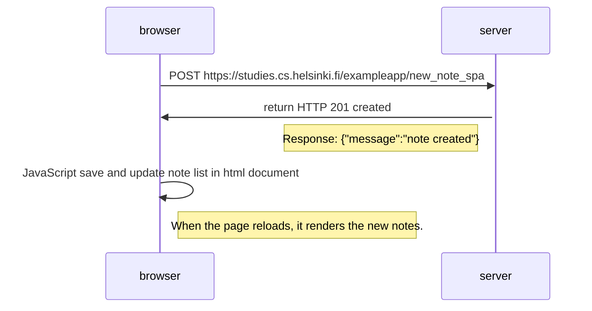

```mermaid
sequenceDiagram
    participant browser
    participant server
    browser->>server: POST https://studies.cs.helsinki.fi/exampleapp/new_note_spa
    activate server
    server->>browser: return HTTP 201 created
    Note left of server: Response: {"message":"note created"}
    browser->>browser: JavaScript save and update note list in html document
    Note right of browser: When the page reloads, it renders the new notes.
```
